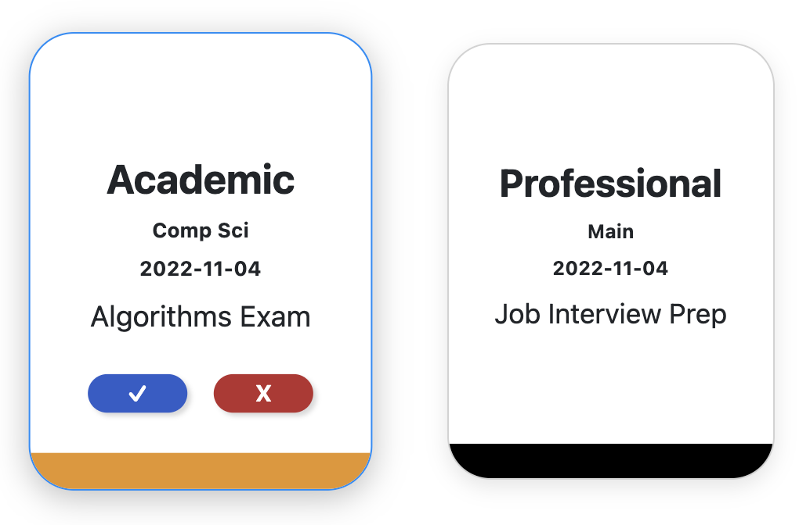
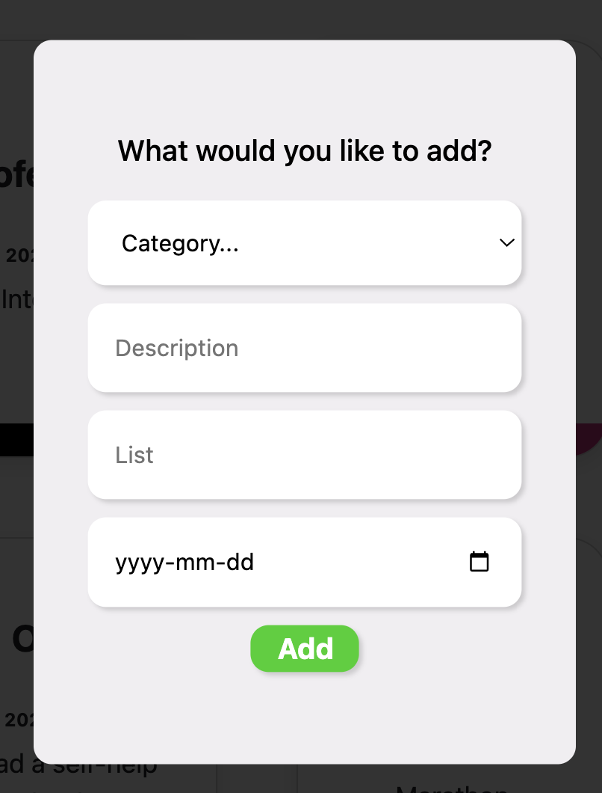
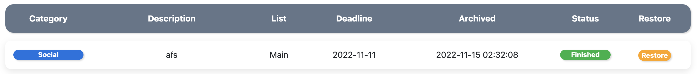

# CS50/Odin Project To-Do Wiz

Dynamic To-Do cards that change their size on hover.

Pop-up form accessible from every page on the website. It uses JSON to connect with the backend. 

 

Dynamically generated history table with categories, status colored by the appropiate color. A restore button. Elements changes on hover. 

#### **Description:**
This is the final project for CS50x and the Odin Project. It's a To-Do manager website capable of registering users, logging them in, and  recording interations in a database. It has a Flask and SQL backend with interactive front-end elements generated with CSS, JavaScript, and Jinja.

#### **Backend: Python, Flask & SQL**
The backend of the webiste is a python titled "app.py" running a flask server and a SQL database with sqlite3. There is also a helpers.py that essentially uses two functions. These are the login_required and apology functions as they proved very useful and there was no need to reinvent the wheel there as they were taken from the CS50 Library.

#### **The following paths exist:**
- "/login" with GET and POST
- "/register" with GET and POST
- "/" with GET
- "/add" with GET and POST
- "/finished" with POST
- "/delete" WITH POST
- "/history" with GET
- "/logout"
- "/restore" with POST

#### **The SQL database "todo.db" has the following tables**
- TABLE users (id INTEGER PRIMARY KEY, username TEXT, password TEXT);
- TABLE todo (id INTEGER, categories TEXT, description TEXT, date TEXT, list TEXT, FOREIGN KEY (id) REFERENCES users (id));
-  TABLE history history (id INTEGER, categories TEXT, description TEXT, date TEXT, dateefin text, how TEXT, list TEXT, FOREIGN KEY (id) REFERENCES users (id));

#### **Frontend: HTML, CSS, Jinja, Javascript**
The frontend was completely written by me with the sole exception of bootstrap forms being used for the login and the register forms. Box-shadow was also taken from the internet.  The elements are dynamic with hover and onclick effects. The JavaScript is written in such a way that appropiate event listeners are added across the pages with functionality that inserts and removes DOM elements when appropiate such as the popup input form. Jinja is used to populate and create elements when querying the server while JS is mainly used to remove or alter elements while pushing a JSON to the backend, initiating a specific procedure such ass adding, recovering or deleting elements. 

