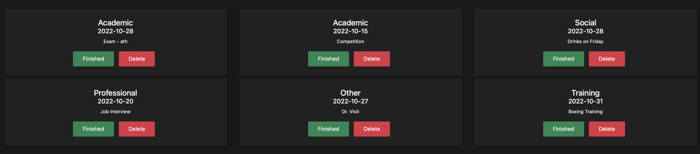

# CS50 To-Do Wiz

### This was my first project ever. The front-end is especially underwheling in this one (and will get fixed when there is more time) but the backend works quite well. 

#### Description: This is the final project for CS50x. It's a To-Do manager website capable of registering users, logging them in, and providing a basic interface of to-do reminders with various categories. It has a Flask and SQL backend with interactive front-end elements.

#### **Inspiration**
##### This project was created as a final project for CS50x. The time constraint of real life had me re-adapting a notable chunk of code from a previous CS50x project titled "Finance". It is not a straight out copy where variable names have been changed but it has taken inspiration as my project required some of the same elements such as hosting a Flask server, login, registering, SQL server and so on.

#### **Backend: Python, Flask & SQL**
##### The backend of the webiste is a python titled "app.py" running a flask server and a SQL database with sqlite.
#### ***The following paths exist:**
- "/login" with GET and POST
- "/register" with GET and POST
- "/" with GET
- "/add" with GET and POST
- "/finished" with POST
- "/delete" WITH POST
-"/history" with GET
-"/logout"

#### **The SQL database "todo.db" has the following tables**
- TABLE users (id INTEGER PRIMARY KEY, username TEXT, password TEXT);
- TABLE todo (id INTEGER, categories TEXT, description TEXT, date TEXT, FOREIGN KEY (id) REFERENCES users (id));
-  TABLE history (id INTEGER, categories TEXT, description TEXT, date TEXT, dateefin text, how TEXT, FOREIGN KEY (id) REFERENCES users (id));

#### There is also a helpers.py that essentially uses two functions from Finance. These are the login_required and apology functions as they proved very useful and there was no need to reinvent the wheel there.

#### **Frontend: HTML, CSS, Jinja**
The frontend of the server was also heavily inspired by CS50x Finance and at one point used a heavy amount of code from the project that it barely constituted a unique design for the website. Thus, the decision was made to scrap the table function brought over form Finance and to make cards provided by bootstrap with buttons. They were further beautified with open-source code provided on the internet. They are also interactive on hover, adding some dynamism to the website. A new navbar was also created with on hover activation where all the elements are centered. It adaapts depending if you are logged in or logged out. The "Finished" and "Delete" Buttons query the server and add or remove elements. It was attempted to do it without refreshing the webpage via JavaScript but that was a massive failure that could not be remedied within the time constraint I had. The add function consists 3 inputs: Categories, description and date. The history table is a table of all the finished and deleted inputs.

#### **Credit:**
- CS50x for inspiration and the code that could be adapted for the project.
- Bootstrap
- Cards (https://bbbootstrap.com/snippets/bootstrap-information-cards-hover-effect-5811725)
- Button Design (https://bbbootstrap.com/snippets/buttons-text-and-font-awesome-icons-75663392)
- Navbar (https://bbbootstrap.com/snippets/bootstrap-navbar-no-collapse-mobile-view-85981100)

